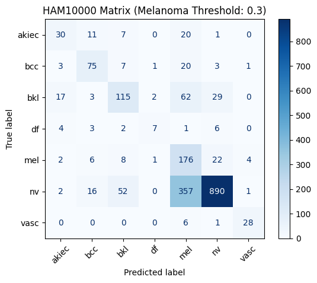

# Cancer-Detection

## Deep Learning for Skin Lesion Classification Automated Multi-Class Detection using the HAM10000 Dataset

## 📌 Project Overview
This project focuses on the automated classification of skin lesions into seven diagnostic categories. Leveraging the HAM10000 ("Human Against Machine") dataset, I developed a Convolutional Neural Network (CNN) to assist in the early detection of skin pathologies, with a specific focus on optimizing recall for Melanoma.
## 🚀 Key Features

* Multi-Class Classification: Categorizes lesions into 7 types (Melanocytic nevi, Melanoma, Basal cell carcinoma, etc.).
* Class Imbalance Handling: Utilized data augmentation and class weighting to address the high prevalence of certain categories.
* Performance Tracking: Optimized for Recall rather than just AUC, ensuring higher sensitivity for malignant cases.

## 📊 Technical Performance

| Metric | Value | Note |
|---|---|---|
| AUC | 0.89 | 
| Melanoma Recall | 80% |
| Model Framework | TensorFlow / Keras | |

## 🛠 Tech Stack

* Language: Python
* Libraries: TensorFlow, Keras, NumPy, Pandas, Matplotlib, Scikit-learn
* Data Processing: OpenCV for image resizing and normalization

## 📂 Dataset
The model uses the HAM10000 dataset, which consists of 10,015 dermatoscopic images.

* Dataset Link

## 🧬 Model Architecture

   1. Input Layer: 224x224x3 images.
   2. MobileNetv2 Model along with Dense layers + finetunning hyperparameters.
   3. Regularization: Dropout layers to prevent overfitting.
   4. Output Layer: Softmax activation for 7-class probability distribution.

------------------------------
Author: Aditya Sajgotra
### 🌐 Connect with Me
[LinkedIn](https://www.linkedin.com/in/aditya-sajgotra-77a067296/) | [Email](mailto:adityasajgotra30@gmail.com)

------------------------------

